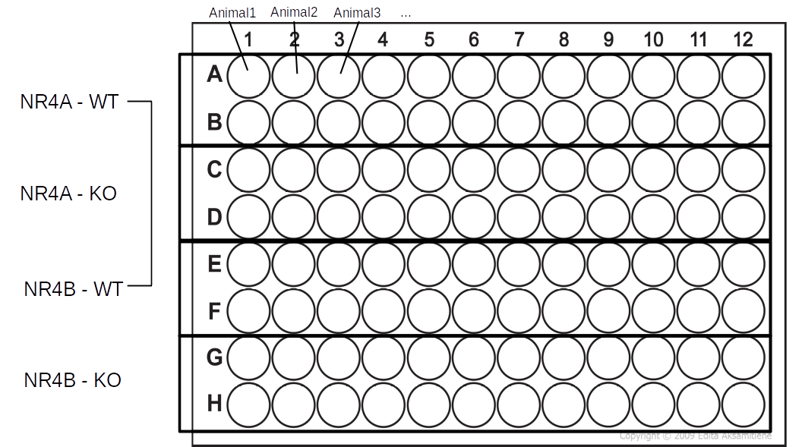
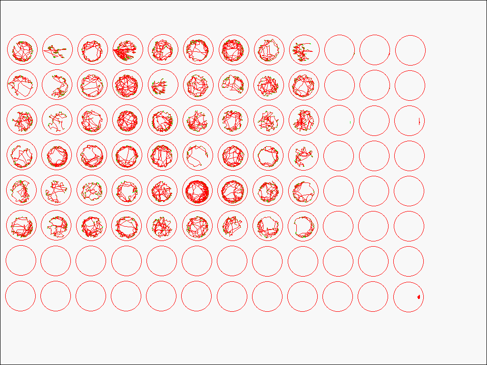

```{r 1setup, include=FALSE}
knitr::opts_chunk$set(echo = TRUE)
options(scipen = 9)
```

```{r 2libraries, include=FALSE}
library(knitr)
library(kableExtra)
library(gridExtra)
library(rlang)
library(DescTools)
library(plyr)
library(ggplot2)
library(dplyr)
library(tidyr)
library(readr)
library(stringr)
library(tibble)
library(data.table)
library(car)
library(lazyeval)
```


# Behavioural Analysis Report -- `r noquote(params$value)`

## Background
  
Zebrafish larvae are pipetted into 96-Well plates.
There is one experiment included in the data set, with 2 NR4A Knockouts and one Wildtype genotype. There are 48 wildtype (24 - WTa, 24 - WTb) biological replicates and 24 of each gene knockout group (24 - NR4Aa, 24 - NR4Ab) -- A total of 96 biological samples.
```{r 5figure2, echo=FALSE, fig.align='center', fig.cap='Figure 2. Figure title', out.height="60%", out.width="60%"}

# Put an image in the same directory as the .rmd file that describes the 96-well plate set up
```

The behavioural data is collected using an infrared camera over a 50-minute period where the first 20 minutes allow the zebrafish embryos to acclimate to their environment, and for the next 30 minutes there are 5-minute cycles of light and darkness -- 96-well plate format. Zebrafish naturally tend to be more active in the dark.
```{r 6experiment_protocol_visualization, echo=FALSE, fig.align='center', fig.cap='Figure 3. A visual representation of the behavioural assay protocol', out.height="75%", out.width="75%"}
ggplot(data = data.frame(x = c(1:50), y = c(1:50))) + 
  geom_blank(aes(x = x, y = y)) + 
  geom_rect(
  data = data.frame(start = c(20, 30, 40), end = c(25, 35, 45)),
  aes(
    xmin = start,
    xmax = end,
    ymin = -Inf,
    ymax = Inf
  ),
  fill = 'black',
  alpha = 0.2
) + 
  geom_vline(xintercept = 20, linetype = "dashed") + ylab("response") + xlab("time in minutes") + 
  geom_text(data = data.frame(
  xvar = c(10, 22.5, 27.5, 32.5, 37.5, 42.5, 47.5),
  yvar = c(25, 40, 10, 40, 10, 40, 10),
  labvar = c("Acclimation", "Dark", "Light", "Dark", "Light", "Dark", "Light")
),
aes(x = xvar, y = yvar, label = labvar))
```

The infrared camera traces the swim paths of fish during the entire experiment. A one-minute snapshot of raw swim paths look like this:
```{r 7figure4, echo=FALSE, fig.align='center', fig.cap='Figure 4. An example of what the raw swim-path tracing looks like from the Viewpoint Zebrabox infrared camera and Viewpoint Zebralab software', out.height="50%", out.width="50%"}

```
The raw data contain many variables that we will explore once we import the data. You can browse the meta data in the next section of this report.

## Directory & Meta Data
```{r 8directory, include=FALSE}
dir <- paste0(getwd(), "/Data")
```

.XLS files have been converted to .csv files and are included in the directory `r dir`. These are the raw data files that this EDA will be using.
```{r 9directory_files_filenames, include=FALSE}
# before running this chunk, rename the .csv file containing the raw behavioural data, seperated by and underscore: all groups (nr4aWT, nr4bWT, ...) 
fileNames <- list.files("Data") #Get the name of each .csv file
genotypeNames <- str_split(string = fileNames[2], pattern = ".csv", simplify = TRUE)[,1] #Identify the genotypes included in the files
genotypeNames <- str_split(string = genotypeNames, pattern = "_")[[1]] #Genotype Names are seperated by underscores int he file name
metaData <- read.csv(file = "Data/MetaData.csv") #Import the Meta Data that includes information about the data
#CAS is the Chemical Abstract Service, MOA is the Mode of Action. This table includes useful information about the exposure concentrations for each chemical dose in mg/L. We'll use this later to create our final data frame
metaData
```

```{r 10metadata_table, echo=FALSE}
metaData %>%
  kable(
    col.names = c(
      "Animal",
      "Treatment",
      "Genotype",
      "Subtype"
    ),
    align = "lllr",
    caption = "Table 1. Information about each chemical included in the experiment with dose information in some units"
  ) %>%
  kable_styling(full_width = TRUE) %>%
  scroll_box(height = "400px")
```

## Importing the raw data files & taking a glimpse

Glimpse the raw data to see the structure of each variable, the number of observations and the class of the `raw_data` object
```{r 11glimpse_raw_data, echo=FALSE, collapse=TRUE}
# list <- list()
# for (i in 1:length(fileNames)) {
#   list[[i]] <- read_delim(file = paste0("Data/Raw/", fileNames[[i]]),
#                           col_names = TRUE,
#                           col_types = "cclnninninninnin", #Where c is character, l is logical, n is numeric, i is integer
#                           na = c("", 'NA', "NA", "\t NA", "\tNA") #Specify what to consider NA
#   )
# }
# names(list) <- chemicalNames #Name List objects


raw_data <- read_csv(file = "Data/nr4a-wt_nr4b-wt_nr4a-ko_nr4b-ko.csv", col_names = TRUE, col_types = "cclnninninninnin", na = c("", 'NA', "NA", "\t NA", "\tNA", "-"))

glimpse(raw_data)
class(raw_data)
```
From the glimpse it can be seen that there are 16 variables in the tibble/data frame:

* `animal` represents individual animals in the experiment
* `Treatment` The chemical and dose group
* `an` Unknown/not useful
* `start` start time of observation in seconds
* `end` end time of observation in seconds
* `inact` Inactivity Counts | the number of times the fish went from being active to inactive over the observation time
* `inadur` Inactivity Duration | the duration of time, in seconds, the fish went from being active to inactive over the observation time (1 minute)
* `inadist` Inactivity Distance | the distance travelled by inactive observations (this value should be 0)
* `smlct` Small Activity Counts | the number of times the fish had a small burst of swim activity over the observation time (1 minute)
* `smldur` Small Activity Duration | the duration of the small burst of swim activity over the observation time (1 minute)
* `smldist` Small Activity Distance | The distance travelled during small bursts of activity
* `larct` Large Activity Counts | the number of times the fish had a large burst of swim activity over the observation time (1 minute)
* `lardur` Large Activity Duration | the duration of the large burst of swim activity over the observation time (1 minute)
* `lardist` Large Activity Distance | The distance travelled during large bursts of activity
* `emptyct` Counts that were neither inactive or active (data recording artifact)
* `emptydur` duration of time fish was neither inactive, or active (data recording artifact) | Almost acts like a confidence value. The closer it is to 60, the more unreliable the data are

## Investigating `raw_data`
### Checking expectations
#### Number of observations/rows
It is expected that the raw data will have `r 96*50*1` rows because there are 96 wells, and the assay is 50 minutes
```{r 12n_rows, echo=TRUE, collapse=TRUE}
nrow(raw_data)
```
However, there are `r nrow(raw_data)` rows present in the raw data. This expectation was violated because each observation is duplicated and there are some extra observations
```{r 13duplicates, echo=FALSE}
raw_data %>%
  select(Treatment, an, end, smldist, lardist, emptyct, emptydur) %>%
  head()
```
By looking at just the head of `raw_data`, it can be seen that the variable `an` has a `TRUE` and `FALSE` row for each individual observation. The only difference between these duplicate rows is that the `FALSE` rows retain information about `emptyct` and `emptydur`.\
```{r 14nrow_filtered_raw_data, echo=TRUE, collapse=TRUE}
raw_data <- raw_data %>%
  filter(an == FALSE) %>% # Removing duplicate rows
  select(-c(an)) # This variable is not very useful anymore, so removing
nrow(raw_data)
```
After filtering for just the false values, there are now `r nrow(raw_data)` rows.\ 
There are `r nrow(raw_data) - (96*50*1)` extra observations in `raw_data` because there are some extra observations past 50 minutes.\ 
```{r 15nrow_raw_data_filtered_2, echo=TRUE, collapse=TRUE}
raw_data <- raw_data %>%
  filter(end <= 3000) # Deleting observations past 50 mins (3000 seconds)
nrow(raw_data)
identical(as.numeric(nrow(raw_data)), (96 * 50 * 1)) # is the expected number of rows consistent with the observed number of rows after processing?
```
After ensuring there are no observations past the 50-minute mark, there are now `r nrow(raw_data)` rows, as expected.

#### Treatment-level NAs
It is expected that there will be no NAs in the treament column because every well is filled with a larval zebrafish (Figure 2).
```{r 16removeNAs, echo=TRUE, collapse=TRUE, include=FALSE}
# raw_data <- raw_data %>%
#   filter(Treatment != is.na(Treatment))
# nrow(raw_data)
# identical(as.numeric(nrow(raw_data)), (84 * 50 * 1)) # Does the expected number of rows match the observed number of rows after filtering?
```

#### Variable Distributions & Outliers

Quick visualizations of the distributions of each variable are a fast and easy way to learn a lot about the data such as the range, distribution of observations, and outliers.\
\
First, the 'counts' variable distributions will be investigated.
```{r 17qplots_counts, echo=FALSE, warning=FALSE, message=FALSE, fig.height=6 , fig.align='center', fig.cap="Figure 5. Quick plots of the 'counts' variables in the `raw_data` object", out.height= "150%", out.width= "150%"}
grid.arrange(
  qplot(
    data = raw_data,
    x = emptyct,
    xlim = c(-15, 100),
    xlab = "Number of times counted as an empty well in a minute (artifact) `emptyct`"
  ),
  qplot(
    data = raw_data,
    x = inact,
    xlim = c(-15, 200),
    xlab = "Number of times counted as inactive in a minute `inact`"
  ),
  qplot(
    data = raw_data,
    x = smlct,
    xlim = c(-15, 400),
    xlab = "Number of times counted as a small activity in a minute `smlct`"
  ),
  qplot(
    data = raw_data,
    x = larct,
    xlim = c(-15, 400),
    xlab = "Number of times counted as a large activity in a minute `larct`"
  ),
  nrow = 4
)
```
Figure 5 (plot 1) shows that there are some artifacts in the data. Sometimes, the camera/software was not able to detect a fish even though, there certainly were fish in those wells. The `emptyct` variable (plot 1) is a good tool to use for flagging observations that need to transformed to `NA`s in the next section (Suspicious Values).\
It can be seen that the amount of times an animal goes inactive during an observation period (`inact`) is approximately ~60 times per minute on average. As well, it can be seen that small swim bursts (`smlct`) tend to occur just over 225 times per minute on average. And finally, we can see that large swim bursts (`larct`) can either occur just over 200 times per minute, or 0 times per minute. This could be due to sensitive effects of light on swim inhibition, or darkness stimulating large swim behaviours.\
\
The distributions of all count variables are slightly skewed, with few outliers, except for the empty well counts which are very positively skewed.\
\
Next, the 'duration' variable distributions will be explored. Note: this variable should never exceed 60 seconds.
```{r 18qplots_duration, echo=FALSE, warning=FALSE, message=FALSE, fig.height=6 , fig.align='center', fig.cap="Figure 6. Quick plots of the 'duration' variables in the `raw_data` object", out.height= "150%", out.width= "150%", fig.height = 7.5, fig.width=7}
raw_data <- raw_data %>%
  mutate(activedur = smldur + lardur)
grid.arrange(
  qplot(
    data = raw_data,
    x = emptydur,
    xlim = c(-5, 65),
    xlab = "Amount of time animals were not found in a 60 second observation (artifact) `emptydur`"
  ) + geom_vline(xintercept = 20, linetype = "dashed", color = "red"),
  qplot(
    data = raw_data,
    x = inadur,
    xlab = "Amount of time animal spent inactive in a 60 second observation `inadur`",
    xlim = c(-5, 65)
  ),
  qplot(
    data = raw_data,
    x = activedur,
    xlab = "Amount of time animal spent active in a 60 second observation `activedur`",
    xlim = c(-5, 65)
  ),
  qplot(
    data = raw_data,
    x = smldur,
    xlab = "Amount of time animal spent doing small swimming motions in a 60 second observation `smldur`",
    xlim = c(-5, 65)
  ),
  qplot(
    data = raw_data,
    x = lardur,
    xlab = "Amount of time animal spent doing large swimming motions in a 60 second observation `lardur`",
    xlim = c(-5, 65)
  ) + geom_vline(xintercept = 40, linetype = "dashed", color = "red"),
  nrow = 5
)
```
Figure 6 reveals another red flag with the `emptydur` variable (plot 1 in figure 6). There are some observations that show 60 full seconds of being empty! This is likely more than just an artifact in the recording instrument/software. These are likely dead or immobile fish that never moved at all so the infrared camera was never able to start tracing their swim patterns (during that 60-second observation period). However, it can also be seen that there are some observations greater than 0 and less than 60 in this plot. In theory, if an animal is present in the well, the `emptydur` value should always be zero. An arbitrary threshold of 20 seconds of empty duration will be used to transform all observations (across variables) with an `emptydur` > 20 into `NA`s\
\
Again, it can also be seen that the distributions of observations for each variable is slightly skewed. Note also that `inadur` and `activedur` (plots 2 and 3 from figure 6) are approximately inversely related as expected. The emerging pattern of large swim activity duration (`lardur`) clustering around two modes (0s and ~20s) can be observed, similar to the counts variable.\
\

Behavioural perturbation (hyperactivity) suggests that it is possible that these chemicals can effect the nervous system of individuals early on in development. However, it is wise to be cautious and not draw any conclusions yet without any sort of statistical analyses.\
\
Next, the distributions of the 'distance' variables will be investigated.
```{r 20distance_qplots, echo=FALSE, fig.align='center', fig.cap="Figure 7. Quick plots of the 'distance' variable in the `raw_data` object", warning=FALSE, message=FALSE, fig.height = 5, fig.width = 7.5, out.height= "150%", out.width= "150%"}
raw_data <- raw_data %>%
  mutate(totaldist = smldist + lardist)
grid.arrange(
  qplot(
    data = raw_data,
    x = smldist,
    xlab = "Distance travelled during small swimming motions in a minute `smldist`"
  ),
  qplot(
    data = raw_data,
    x = lardist,
    xlab = "Distance travelled during large swimming motions in a minute `lardist`",
    xlim = c(-100,5000)
  ) + geom_vline(xintercept = 4000, linetype = "dashed", color = "red"),
  qplot(
    data = raw_data,
    x = totaldist,
    xlab = "Distance travelled during all swimming motions in a minute `totaldist`",
    xlim = c(-100,5000)
  ) + geom_vline(xintercept = 4500, linetype = "dashed", color = "red"),
  nrow = 3
)

```
Figure 7 shows that the distributions of of the 'distance' variables are slightly skewed with the `totaldist` variable being the most normally distributed. Notably, `totaldist` seems to be a promising effect endpoint to analyse since it is the most normally distributed of all the other effect endpoints.\
\

### Evaluating Data Quality
Figure 6 showed that the `emptydur` variable can be used reliably to filter out observations with poor data quality. The 'empty duration' variable ranges from 0s to 60s and indicates how long the observation was not able to detect a fish in the well. An arbitrary cutoff value of `r round(60*0.33)` seconds will be used to determine if an observation was of poor-quality and therefore, should be converted to `NA`. By doing this, the confidence in the accuracy of observations can be increased across the entire data set.
```{r 28poor_quality_cutoff, echo=FALSE}
qualityCutoff <- (round(60*0.33))
raw_data <- raw_data %>%
  mutate(poorQual = if_else(condition = emptydur >= qualityCutoff, true = TRUE, false = FALSE)) %>%
  mutate(across(
    .cols = c("inact","inadur","inadist",
              "smlct","smldur","smldist",
              "larct","lardur","lardist"),
    .fns = ~ replace(x = ., list = poorQual, values = NA) 
  ))
```

```{r 29n_NAs, echo=TRUE, collapse=TRUE}
NAObservations <- raw_data %>%
  filter(poorQual == TRUE) %>% # Filter only rows with poor quality that have behavioural endpoint observations turned to NAs
  nrow()
NAObservations
```
`r NAObservations` 60-second observations (rows) were transformed to `NA`s across all of the behavioural endpoint observation variables.\
\
Overall, the animal recording set-up had an approximate failure-rate of `r round((NAObservations/nrow(raw_data))*100)` % -- the percentage of time the infrared camera failed to detect an animal when it was present in a well. 

## Exploring & Visualizing

```{r 30pre_process_1, include=FALSE, class.source ='fold-hide', message=FALSE, warning=FALSE}
# First, splitting the Treatment column into the Chemical, and Dose columns
# raw_data <- raw_data %>%
#   mutate(Chemical = str_split(string = Treatment, pattern = " ", simplify = TRUE)[,1], Dose = str_split(string = Treatment, pattern = " ", simplify = TRUE)[,2])
# raw_data$Dose[which(raw_data$Dose == "")] = 0

# Second, creating new variables, re-ordering columns, removing columns that won't be used, and joining dose information
fishBehavDat <- raw_data %>%
  mutate(
    time_end = end / 60, # time in minutes
    activedur = lardur + smldur, # recalculating variable after poorQuality observations were removed
    totaldist = lardist + smldist, # recalculating variable after poorQuality observations were removed
    velocity = totaldist/activedur
  ) %>%
  inner_join(metaData) %>%
  mutate(Treatment = str_remove_all(Treatment, "[0-9.-]+$")) %>%
  mutate(Genotype = if_else(condition = is.na(Subtype), true = paste(Genotype), false = paste(Subtype, Genotype))) %>%
  select(animal, Treatment, Genotype, Subtype, time_end, inact, smlct, larct, inadur, smldur, lardur, activedur, smldist, lardist, totaldist, emptydur, velocity, poorQual)
```


### ggplots 

#### Bar Graphs

```{r 32binning_fishBehavDat, include=FALSE}
fishBehavDatBin5 <- fishBehavDat %>%
  mutate(Cycle = if_else(
    condition = time_end >= 1 &
      time_end <= 20,
    true = "Acclimation",
    false = if_else(
      condition = time_end >= 21 &
        time_end <= 25,
      true = "Dark_1",
      false = if_else(
        condition = time_end >= 26 &
          time_end <= 30,
        true = "Light_1",
        false = if_else(
          condition = time_end >= 31 &
            time_end <= 35,
          true = "Dark_2",
          false = if_else(
            condition = time_end >= 36 &
              time_end <= 40,
            true = "Light_2",
            false = if_else(
              condition = time_end >= 41 &
                time_end <= 45,
              true = "Dark_3",
              false = "Light_3"
            )
          )
        )
      )
    )
  ))
```

```{r 33Anova, echo=FALSE}
cycle_filter <- c("Light_1",
      "Dark_1",
      "Light_2",
      "Dark_2",
      "Light_3",
      "Dark_3")

aov_list <- NULL
pval_list <- NULL
  for (i in 1:6) {
    temp <- fishBehavDatBin5 %>%
      filter(Cycle != "Acclimation") %>%
      select(-Subtype) %>%
      group_by(Cycle, Genotype) %>%
      na.omit() %>%
      as.data.frame() %>%
      filter(Cycle == cycle_filter[i]) # 6 cycles in total - Light & Dark 1 through 3
    temp_aov <- aov(get(params$value) ~ Genotype, data = temp)
    aov_list[[i]] <- summary(temp_aov)
    pval_list[[i]] <- na.omit(aov_list[[i]][[1]][[5]])[1]
  }
names(aov_list) <- cycle_filter
names(pval_list) <- cycle_filter
# aov_p_results <- ldply(pval_list) %>%
#   rename(Cycle = .id, p_value = V1) %>%
#   mutate(p_value = p.adjust(p_value, method = "fdr")) %>%
#   mutate(is_sig = if_else(condition = p_value <= 0.05, true = TRUE, false= FALSE)) %>%
#   mutate(p_value = formatC(p_value, format = "e", digits = 2))
#   
# kable(aov_p_results, align = "lr", caption = paste("Table 2 - ANOVA test p-values after FDR adjustment, comparing effects of different genotypes on", params$value, "for each light cycle")) %>%
#     kable_styling(full_width = TRUE) %>%
#   scroll_box(height = "400px")
```

```{r 33.1Write_aov_results, include=FALSE}
d <- data.frame()
for (i in 1:length(cycle_filter)){
temp <- data.frame(Df = aov_list[[cycle_filter[i]]][[1]][[1]], 
                   Sum_Sq = aov_list[[cycle_filter[i]]][[1]][[2]],
                   Mean_Sq = aov_list[[cycle_filter[i]]][[1]][[3]],
                   F_Value = aov_list[[cycle_filter[i]]][[1]][[4]],
                   P_value = aov_list[[cycle_filter[i]]][[1]][[5]],
                   row.names = c(paste0(names(aov_list[i]), "_Genotype"), paste0(names(aov_list[i]), "_Residuals")))
temp$Measurement <- row.names(temp)
d <- rbind(d, temp)
}
```

```{r 33.2Write_aov_results, include=FALSE}
write_csv(d, file = paste0("./Output/Five_Minute_Bins/", params$value, "_aov_results.csv"))
```

```{r 33.3AOV_Results_Kable, echo=FALSE}
d %>%
  select(-Measurement) %>%
  mutate(is_sig = if_else(condition = P_value <= 0.05, true = TRUE, false= FALSE),
         P_value = formatC(P_value, format = "e", digits = 2)) %>%
  kable(caption = paste("Table 2 - ANOVA test p-values after FDR adjustment, comparing effects of different genotypes on", params$value, "for each light cycle")) %>%
  kable_styling(full_width = TRUE) %>%
  scroll_box(height = "400px")
```


```{r 33Dunnetts_test, echo=FALSE, include=FALSE}
cycle_filter <- c("Light_1",
      "Dark_1",
      "Light_2",
      "Dark_2",
      "Light_3",
      "Dark_3")
GenotypeNames <- c("WT", "nr4a2a KO", "nr4a2b KO")
set.seed(42)

dun_list <- NULL
dun_list_2 <- NULL
for (j in 1){
  for (i in 1:6) {
    temp <- fishBehavDatBin5 %>%
      filter(Cycle != "Acclimation") %>%
      select(-Subtype) %>%
      group_by(Cycle, Genotype) %>%
      na.omit() %>%
      as.data.frame() %>%
      filter(Cycle == cycle_filter[i]) # 6 cycles in total - Light & Dark 1 through 3
    temp_dun <- DunnettTest(get(params$value) ~ Genotype, data = temp, control = "WT")
    # temp_dun$Control[,4] <- p.adjust(temp_dun$Control[,4], method = "fdr")
    # new_row <- matrix(data = c(NA,NA,NA,NA), nrow = 1, ncol = 4)
    # row.names(new_row) <- "Control-Control"
    # colnames(new_row) <- c("diff", "lwr.ci", "upr.ci", "pval")

    dun_list[[cycle_filter[i]]] <- temp_dun[[1]] %>%
      as.data.frame() %>%
      # rbind(new_row) %>%
      rownames_to_column(var = "Genotype")

  }
  dun_list_2[[GenotypeNames[j]]] <- ldply(dun_list, .id = "Cycle")
  dun_list_2[[j]]$pval <- p.adjust(dun_list_2[[j]]$pval, method = "fdr") # p value adjustment https://www.ncbi.nlm.nih.gov/pmc/articles/PMC6099145/ (for single test - same samples)

  new_row <- as.data.frame(matrix(data = c("Light_1", "WT-WT", NA, NA, NA, 1,
                           "Dark_1", "WT-WT", NA, NA, NA, 1,
                           "Light_2", "WT-WT", NA, NA, NA, 1,
                           "Dark_2", "WT-WT", NA, NA, NA, 1,
                           "Light_3", "WT-WT", NA, NA, NA, 1,
                           "Dark_3", "WT-WT", NA, NA, NA, 1),
                  nrow = 6, ncol = 6, byrow = TRUE))
  colnames(new_row) <- c("Cycle", "Genotype", "diff", "lwr.ci", "upr.ci", "pval")
  new_row$pval <- as.numeric(new_row$pval)

  dun_list_2[[j]] <- dun_list_2[[j]] %>%
    rbind(new_row)
}

dunnett_binned <- ldply(dun_list_2, .id = "Genotype")

dunnett_binned$Genotype = str_split(string = dunnett_binned$Genotype, pattern = "-", simplify = T)[,1] #Here we are fixing the dose column... the dose column has the test dose related to the control... but we just want to see what the test dose is without it giving us redundant information about the comparison to the control for every observation...
```

```{r 34summary_all_chems, include=FALSE}
summary_fishBehavDatBin <- fishBehavDatBin5 %>%
  mutate(Cycle = factor(
    Cycle,
    levels = c(
      "Acclimation",
      "Light_1",
      "Dark_1",
      "Light_2",
      "Dark_2",
      "Light_3",
      "Dark_3"
    ),
    ordered = TRUE
  )) %>%
  filter(Cycle != "Acclimation") %>%
  group_by(Genotype, Cycle) %>%
  summarise(
    se = sd(get(params$value), na.rm = TRUE) / sqrt(length(get(params$value))),
    sd = sd(get(params$value), na.rm = TRUE),
    mean = mean(get(params$value), na.rm = TRUE),
    median = median(get(params$value), na.rm = TRUE),
    .groups = "keep"
  )
```

```{r 35dunnett_summary_all_chems, include=FALSE}
dunnett_binned$Cycle <-
  factor(
    dunnett_binned$Cycle,
    levels = c(
      "Acclimation",
      "Light_1",
      "Dark_1",
      "Light_2",
      "Dark_2",
      "Light_3",
      "Dark_3"
    ),
    ordered = TRUE
  )
dunnett_summary_all_chems <-
  right_join(dunnett_binned, summary_fishBehavDatBin)
# dunnett_summary_all_chems$Dose <- factor(dunnett_summary_all_chems$Dose, levels = c("Control", "Dose5", "Dose4", "Dose3", "Dose2", "Dose1"), ordered = TRUE)
```

```{r 35.1Write_Dunnett_Results, include=FALSE}
write_csv(dunnett_summary_all_chems, file = paste0("./Output/Five_Minute_Bins/", params$value, "_dunnett_results.csv"))
```

```{r 36meanparam&value_BinnedDat, echo=FALSE}


  p <- dunnett_summary_all_chems %>%
    ggplot(aes(
      x = Cycle,
      y = mean,
      fill = Genotype,
    )) +
    geom_col(position = "dodge") +
    geom_errorbar(aes(ymin = mean + se, ymax = mean + se),
                  width = .5,
                  position = position_dodge(0.9)) +
    geom_linerange(aes(ymin = mean, ymax = mean + se, group = Genotype), position = position_dodge(width = 0.9)) +
    scale_fill_grey(start = 0, end = 0.9) +
    scale_colour_grey(start = 0, end = 0.9) +
    geom_text(
      aes(
        label = if_else(
          condition = pval > 0.1,
          true = "",
          false = if_else(
            condition = pval <= 0.1 &
              pval > 0.05,
            true = "",
            if_else(
              condition = pval <= 0.05 &
                pval > 0.01,
              true = "*",
              false = if_else(
                condition = pval <= 0.01 &
                  pval > 0.001,
                true = "**",
                false = if_else(pval <= 0.001, true = "***", false = "")
              )
            )
          )
        ),
        group = Genotype,
        y = mean + se + 1
      ),
      position = position_dodge(width = 0.9),
      color = "black",
      size = 3.75
    ) +
    ylab(paste("Mean", params$value)) +
    xlab("") +
    theme_classic()


```

##### Plots Binned by individual 5-minute cycles {.tabset}
```{r 36.1meanparam&value_BinnedDat, echo = FALSE, fig.cap="Figure 8. The effect of genotype on behavioural response variable binned by individual 5-minute-long light and dark cycles"}
p
```

```{r 37binning_fishBehavDatLD, include=FALSE}
fishBehavDatBinLD <- fishBehavDat %>%
  mutate(Cycle = if_else(
    condition = time_end >= 1 &
      time_end <= 20,
    true = "Acclimation",
    false = if_else(
      condition = time_end >= 21 &
        time_end <= 25,
      true = "Dark",
      false = if_else(
        condition = time_end >= 26 &
          time_end <= 30,
        true = "Light",
        false = if_else(
          condition = time_end >= 31 &
            time_end <= 35,
          true = "Dark",
          false = if_else(
            condition = time_end >= 36 &
              time_end <= 40,
            true = "Light",
            false = if_else(
              condition = time_end >= 41 &
                time_end <= 45,
              true = "Dark",
              false = "Light"
            )
          )
        )
      )
    )
  ))
```


```{r 38ANOVA_LD, echo=FALSE}
cycle_filter <- c("Light",
      "Dark")

aov_list <- NULL
pval_list <- NULL
  for (i in 1:2) {
    temp <- fishBehavDatBinLD %>%
      filter(Cycle != "Acclimation") %>%
      select(-Subtype) %>%
      group_by(Cycle, Genotype) %>%
      na.omit() %>%
      as.data.frame() %>%
      filter(Cycle == cycle_filter[i]) # 6 cycles in total - Light & Dark 1 through 3
    temp_aov <- aov(get(params$value) ~ Genotype, data = temp)
    aov_list[[i]] <- summary(temp_aov)
    pval_list[[i]] <- na.omit(aov_list[[i]][[1]][[5]])[1]
  }
names(aov_list) <- cycle_filter
names(pval_list) <- cycle_filter
# aov_p_results <- ldply(pval_list) %>%
#   rename(Cycle = .id, p_value = V1) %>%
#   mutate(p_value = p.adjust(p_value, method = "fdr")) %>%
#   mutate(is_sig = if_else(condition = p_value <= 0.05, true = TRUE, false= FALSE)) %>%
#   mutate(p_value = formatC(p_value, format = "e", digits = 2))
# 
# kable(aov_p_results, align = "lrr", caption = paste("Table 3 - ANOVA test p-values after FDR adjustment, comparing effects of different genotypes on", params$value, "for each light cycle")) %>%
#     kable_styling(full_width = TRUE) %>%
#   scroll_box(height = "400px")
```

```{r 37.1Write_aov_results, include=FALSE}
d <- data.frame()
for (i in 1:length(cycle_filter)){
temp <- data.frame(Df = aov_list[[cycle_filter[i]]][[1]][[1]], 
                   Sum_Sq = aov_list[[cycle_filter[i]]][[1]][[2]],
                   Mean_Sq = aov_list[[cycle_filter[i]]][[1]][[3]],
                   F_Value = aov_list[[cycle_filter[i]]][[1]][[4]],
                   P_value = aov_list[[cycle_filter[i]]][[1]][[5]],
                   row.names = c(paste0(names(aov_list[i]), "_Genotype"), paste0(names(aov_list[i]), "_Residuals")))
temp$Measurement <- row.names(temp)
d <- rbind(d, temp)
}
```

```{r 37.2Write_aov_results, include=FALSE}
write_csv(d, file = paste0("./Output/Light_Dark_Bins/", params$value, "_aov_results.csv"))
```

```{r 37.3AOV_Results_Kable, echo=FALSE}
d %>%
  select(-Measurement) %>%
  mutate(is_sig = if_else(condition = P_value <= 0.05, true = TRUE, false= FALSE),
         P_value = formatC(P_value, format = "e", digits = 2)) %>%
  kable(caption = paste("Table 3 - ANOVA test p-values after FDR adjustment, comparing effects of different genotypes on", params$value, "for each light cycle")) %>%
  kable_styling(full_width = TRUE) %>%
  scroll_box(height = "400px")
```

```{r 38Dunnetts_test, echo=FALSE}
cycle_filter <- c("Light", "Dark")

GenotypeNames <- c("WT", "nr4a2a KO", "nr4a2b KO")

dun_list <- NULL
dun_list_2 <- NULL
for (j in 1) {
  for (i in 1:2) {
    temp <- fishBehavDatBinLD %>%
      filter(Cycle != "Acclimation") %>%
      select(-Subtype) %>%
      group_by(Cycle, Genotype) %>%
      na.omit() %>%
      as.data.frame() %>%
      filter(Cycle == cycle_filter[i]) # 2 cycles in total - Light & Dark
    temp_dun <- DunnettTest(get(params$value) ~ Genotype, data = temp, control = "WT")
    # temp_dun$Control[,4] <- p.adjust(temp_dun$Control[,4], method = "fdr") 
    # new_row <- matrix(data = c(NA,NA,NA,NA), nrow = 1, ncol = 4)
    # row.names(new_row) <- "Control-Control"
    # colnames(new_row) <- c("diff", "lwr.ci", "upr.ci", "pval")
    
    dun_list[[cycle_filter[i]]] <- temp_dun[[1]] %>% 
      as.data.frame() %>%
      # rbind(new_row) %>%
      rownames_to_column(var = "Genotype")
    
  }
  dun_list_2[[GenotypeNames[j]]] <- ldply(dun_list, .id = "Cycle")
  dun_list_2[[j]]$pval <- p.adjust(dun_list_2[[j]]$pval, method = "fdr") # p value adjustment https://www.ncbi.nlm.nih.gov/pmc/articles/PMC6099145/ (for single test - same samples)
  
  new_row <- as.data.frame(matrix(data = c("Light", "WT-WT", NA, NA, NA, 1,
                           "Dark", "WT-WT", NA, NA, NA, 1),
                  nrow = 2, ncol = 6, byrow = TRUE))
  colnames(new_row) <- c("Cycle", "Genotype", "diff", "lwr.ci", "upr.ci", "pval")
  new_row$pval <- as.numeric(new_row$pval)

  dun_list_2[[j]] <- dun_list_2[[j]] %>%
    rbind(new_row)
}

dunnett_binned <- ldply(dun_list_2, .id = "Genotype")

dunnett_binned$Genotype = str_split(string = dunnett_binned$Genotype, pattern = "-", simplify = T)[,1] #Here we are fixing the dose column... the dose column has the test dose related to the control... but we just want to see what the test dose is without it giving us redundant information about the comparison to the control for every observation...
```

```{r 39summary_all_chems, include=FALSE}
summary_fishBehavDatBinLD <- fishBehavDatBinLD %>%
  mutate(Cycle = factor(
    Cycle,
    levels = c(
      "Acclimation",
      "Light",
      "Dark"
    ),
    ordered = TRUE
  )) %>%
  filter(Cycle != "Acclimation") %>%
  group_by(Genotype, Cycle) %>%
  summarise(
    se = sd(get(params$value), na.rm = TRUE) / sqrt(length(get(params$value))),
    sd = sd(get(params$value), na.rm = TRUE),
    mean = mean(get(params$value), na.rm = TRUE),
    median = median(get(params$value), na.rm = TRUE),
    .groups = "keep"
  )
```

```{r 40dunnett_summary_all_chems, include=FALSE}
dunnett_binned$Cycle <-
  factor(
    dunnett_binned$Cycle,
    levels = c(
      "Acclimation",
      "Light",
      "Dark"
    ),
    ordered=TRUE
  )
dunnett_summary_all_chems_LD <-
  full_join(dunnett_binned, summary_fishBehavDatBinLD)

```

```{r 40.1Write_Dunnett_results, include=FALSE}
write_csv(dunnett_summary_all_chems_LD, file = paste0("./Output/Light_Dark_Bins/", params$value, "_dunnett_results.csv"))
```


```{r 41meantotaldist_BinnedDatLD, echo=FALSE}


  p <- dunnett_summary_all_chems_LD %>%
    ggplot(aes(
      x = Cycle,
      y = mean,
      fill = Genotype,
    )) +
    geom_col(position = "dodge") +
    geom_errorbar(aes(ymin = mean + se, ymax = mean + se),
                  width = .5,
                  position = position_dodge(0.9)) +
    geom_linerange(aes(ymin = mean, ymax = mean + se, group = Genotype), position = position_dodge(width = 0.9)) +
    scale_fill_grey(start = 0, end = 0.9) +
    scale_colour_grey(start = 0, end = 0.9) +
    geom_text(
      aes(
        label = if_else(
          condition = pval > 0.1,
          true = "",
          false = if_else(
            condition = pval <= 0.1 &
              pval > 0.05,
            true = "",
            if_else(
              condition = pval <= 0.05 &
                pval > 0.01,
              true = "*",
              false = if_else(
                condition = pval <= 0.01 &
                  pval > 0.001,
                true = "**",
                false = if_else(pval <= 0.001, true = "***", false = "")
              )
            )
          )
        ),
        group = Genotype,
        y = mean + se + 1
      ),
      position = position_dodge(width = 0.9),
      color = "black",
      size = 3.75
    ) +
    ylab(paste("Mean", params$value)) +
    xlab("") +
    theme_classic() 


```

##### Plots Binned by cycle type (light or dark - 2 bins - 15mins each) {.tabset}
```{r 41.1meantotaldist_BinnedDat, echo = FALSE, results = 'asis'}
p
```

##### Not-binned


```{r 42ANOVA_Overall, echo=FALSE}

aov_list <- NULL
pval_list <- NULL

    temp <- fishBehavDatBinLD %>%
      filter(Cycle != "Acclimation") %>%
      select(-Subtype) %>%
      group_by(Cycle, Genotype) %>%
      na.omit() %>%
      as.data.frame()
    
    temp_aov <- aov(get(params$value) ~ Genotype, data = temp)
    aov_list <- summary(temp_aov)
    pval_list <- na.omit(aov_list[[1]][[5]])[1]
    
# aov_p_results <- data.frame(Cycle = NA, p_value = formatC(pval_list, format = "e", digits = 2), is_sig = if_else(condition = pval_list <= 0.05, true = TRUE, false = FALSE))
# 
# kable(aov_p_results, align = "lrr", caption = paste("Table 4 - ANOVA test p-values after FDR adjustment, comparing effects of different genotypes on", params$value)) %>%
#     kable_styling(full_width = TRUE) %>%
#   scroll_box(height = "400px")
```

```{r 42.1Write_aov_results, include=FALSE}
d <- data.frame()
temp <- data.frame(Df = aov_list[[1]][[1]], 
                   Sum_Sq = aov_list[[1]][[2]],
                   Mean_Sq = aov_list[[1]][[3]],
                   F_Value = aov_list[[1]][[4]],
                   P_value = aov_list[[1]][[5]],
                   row.names = c("Genotype", "Residuals"))
temp$Measurement <- row.names(temp)
d <- temp
```

```{r 42.2Write_aov_Results, include=FALSE}
write_csv(d, file = paste0("./Output/No_Bins/", params$value, "_aov_results.csv"))
```

```{r 42.3AOV_Results_Kable, echo=FALSE}
d %>%
  select(-Measurement) %>%
  mutate(is_sig = if_else(condition = P_value <= 0.05, true = TRUE, false= FALSE),
         P_value = formatC(P_value, format = "e", digits = 2)) %>%
  kable(caption = paste("Table 4 - ANOVA test p-values after FDR adjustment, comparing effects of different genotypes on", params$value)) %>%
  kable_styling(full_width = TRUE) %>%
  scroll_box(height = "400px")
```

```{r 43Dunnetts_test_OverallDat, echo=FALSE}


dun_list <- NULL

  temp <- fishBehavDat %>%
    mutate(Cycle = if_else(
      condition = time_end >= 1 &
        time_end <= 20,
      true = "Acclimation",
      false = if_else(
        condition = time_end >= 21 &
          time_end <= 25,
        true = "Dark",
        false = if_else(
          condition = time_end >= 26 &
            time_end <= 30,
          true = "Light",
          false = if_else(
            condition = time_end >= 31 &
              time_end <= 35,
            true = "Dark",
            false = if_else(
              condition = time_end >= 36 &
                time_end <= 40,
              true = "Light",
              false = if_else(
                condition = time_end >= 41 &
                  time_end <= 45,
                true = "Dark",
                false = "Light"
              )
            )
          )
        )
      )
    )) %>%
    filter(Cycle != "Acclimation") %>%
    select(-Subtype) %>%
    group_by(Genotype) %>%
    na.omit() %>%
    as.data.frame()
  
  
  
 temp_dun <- DunnettTest(formula = get(params$value) ~ Genotype, data = temp, control = "WT")
  temp_dun$WT[, "pval"] <-
    p.adjust(temp_dun$WT[, "pval"], method = "fdr")
  
  new_row <- matrix(data = c(NA, NA, NA, 1),
                    nrow = 1,
                    ncol = 4,)
  row.names(new_row) <- "WT-WT"
  colnames(new_row) <- c("diff", "lwr.ci", "upr.ci", "pval")
  
  dunnett <- temp_dun[[1]] %>%
    as.data.frame() %>%
    rbind(new_row) %>%
    rownames_to_column(var = "Genotype")
  


dunnett$Genotype = str_split(string = dunnett$Genotype,
                                pattern = "-",
                                simplify = T)[, 1] #Here we are fixing the dose column... the dose column has the test dose related to the control... but we just want to see what the test dose is without it giving us redundant information about the comparison to the control for every observation...
```

```{r 43summary_all_chems_no_bin, include=FALSE}
summary_fishBehavDat <- fishBehavDat %>%
 mutate(Cycle = if_else(
    condition = time_end >= 1 &
      time_end <= 20,
    true = "Acclimation",
    false = if_else(
      condition = time_end >= 21 &
        time_end <= 25,
      true = "Dark",
      false = if_else(
        condition = time_end >= 26 &
          time_end <= 30,
        true = "Light",
        false = if_else(
          condition = time_end >= 31 &
            time_end <= 35,
          true = "Dark",
          false = if_else(
            condition = time_end >= 36 &
              time_end <= 40,
            true = "Light",
            false = if_else(
              condition = time_end >= 41 &
                time_end <= 45,
              true = "Dark",
              false = "Light"
            )
          )
        )
      )
    )
  )) %>%
  filter(Cycle != "Acclimation") %>%
  group_by(Genotype) %>%
  summarise(se = sd(get(params$value), na.rm = TRUE) / sqrt(length(get(params$value))),
    sd = sd(get(params$value), na.rm = TRUE),
    mean = mean(get(params$value), na.rm = TRUE),
    median = median(get(params$value), na.rm = TRUE))
```

```{r 44joined_dunnet_summary_no_bin, include=FALSE}
dunnett_summary_all_chems_no_bin <- full_join(dunnett, summary_fishBehavDat)
```


```{r 44.1Write_Dunnett_Results, include=FALSE}
write_csv(dunnett_summary_all_chems_no_bin, file = paste0("./Output/No_Bins/", params$value, "_dunnett_results.csv"))
```


```{r 45meantotaldist, echo=FALSE}

  p <- dunnett_summary_all_chems_no_bin %>%
    ggplot(aes(
      x = Genotype,
      y = mean,
      fill = Genotype,
    )) +
    geom_col(position = "dodge") +
    geom_errorbar(aes(ymin = mean + se, ymax = mean + se),
                  width = .5,
                  position = position_dodge(0.9)) +
    geom_linerange(aes(ymin = mean, ymax = mean + se, group = Genotype), position = position_dodge(width = 0.9)) +
   scale_fill_grey(start = 0, end = 0.9) +
    scale_colour_grey(start = 0, end = 0.9) +
    geom_text(
      aes(
        label = if_else(
          condition = pval > 0.1,
          true = "",
          false = if_else(
            condition = pval <= 0.1 &
              pval > 0.05,
            true = "",
            if_else(
              condition = pval <= 0.05 &
                pval > 0.01,
              true = "*",
              false = if_else(
                condition = pval <= 0.01 &
                  pval > 0.001,
                true = "**",
                false = if_else(pval <= 0.001, true = "***", false = "")
              )
            )
          )
        ),
        group = Genotype,
        y = mean + se + 1
      ),
      position = position_dodge(width = 0.9),
      color = "black",
      size = 3.75
    ) +
    ylab(paste("Mean", params$value)) +
    xlab("") +
    theme_classic()


```

##### Plots Not Binned by cycle {.tabset}
```{r 45.1meantotaldist_BinnedDat, echo = FALSE, results = 'asis'}
p
```
\
\

### Trace Paths

```{r 53TracePaths, echo=FALSE, message=FALSE, warning=FALSE}
start <- c(20,30,40)
end <- c(25,35,45)
dark <- data.frame(start, end)

fishBehavDat %>%
  group_by(Genotype, time_end) %>%
  summarise(se = sd(get(params$value), na.rm = TRUE) / sqrt(length(get(params$value))),
    sd = sd(get(params$value), na.rm = TRUE),
    mean = mean(get(params$value), na.rm = TRUE),
    median = median(get(params$value), na.rm = TRUE)) %>%
  ggplot(aes(x = time_end, y = mean, color = Genotype)) +
  geom_rect(data = dark, inherit.aes = FALSE,
          aes(xmin = start, xmax = end, ymin = -Inf, ymax = Inf),
          alpha = 0.1, fill = 'black') +
  geom_vline(xintercept = 20, linetype = "dashed") +
  geom_line() +
  geom_point(aes(shape = Genotype), size = 2) +
  geom_errorbar(aes(ymin = mean - se, ymax = mean + se, group = Genotype), alpha=0.3) +
  xlab("Time [min]") +
  ylab(paste("Mean", params$value)) +
  theme_classic() +
  scale_color_ordinal()

```

```{r 54TracePaths, echo=FALSE, fig.width=15, fig.height=5, message=FALSE, warning=FALSE}
start <- c(20,30,40)
end <- c(25,35,45)
dark <- data.frame(start, end)

fishBehavDat %>%
  group_by(Genotype, time_end) %>%
  summarise(se = sd(get(params$value), na.rm = TRUE) / sqrt(length(get(params$value))),
    sd = sd(get(params$value), na.rm = TRUE),
    mean = mean(get(params$value), na.rm = TRUE),
    median = median(get(params$value), na.rm = TRUE)) %>%
  ggplot(aes(x = time_end, y = mean)) +
  geom_rect(data = dark, inherit.aes = FALSE,
          aes(xmin = start, xmax = end, ymin = -Inf, ymax = Inf),
          alpha = 0.1, fill = 'black') +
  geom_vline(xintercept = 20, linetype = "dashed") +
  geom_line() +
  geom_point(aes(shape = Genotype), size = 2) +
  geom_errorbar(aes(ymin = mean - se, ymax = mean + se, group = Genotype), alpha=0.3) +
  xlab("Time [min]") +
  ylab(paste("Mean", params$value)) +
  theme_classic() +
  facet_wrap(~Genotype)

```